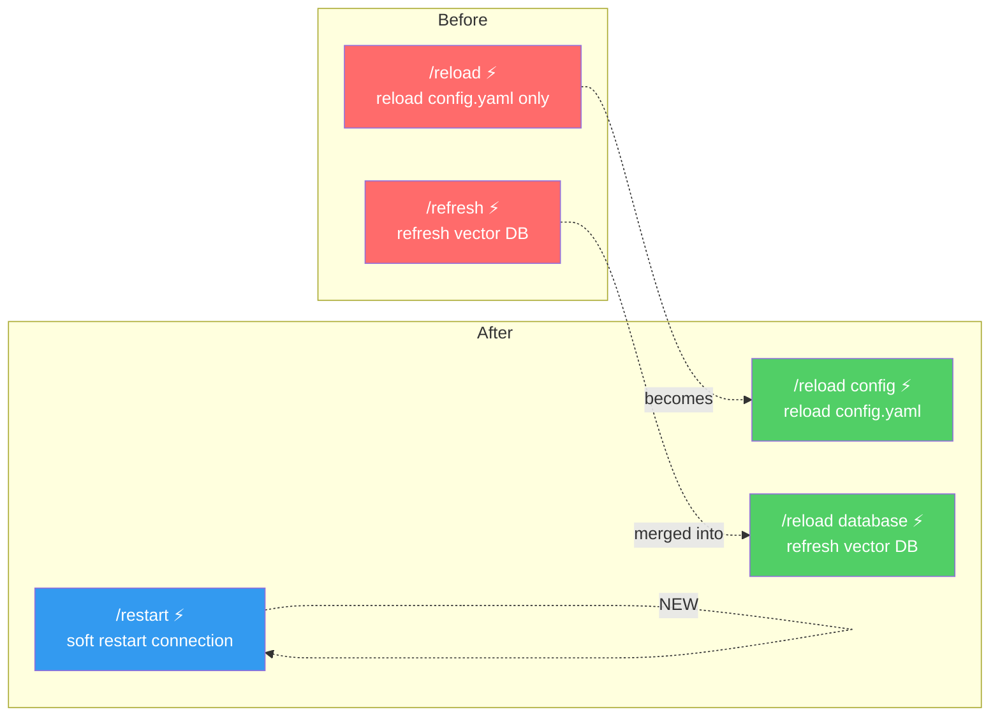
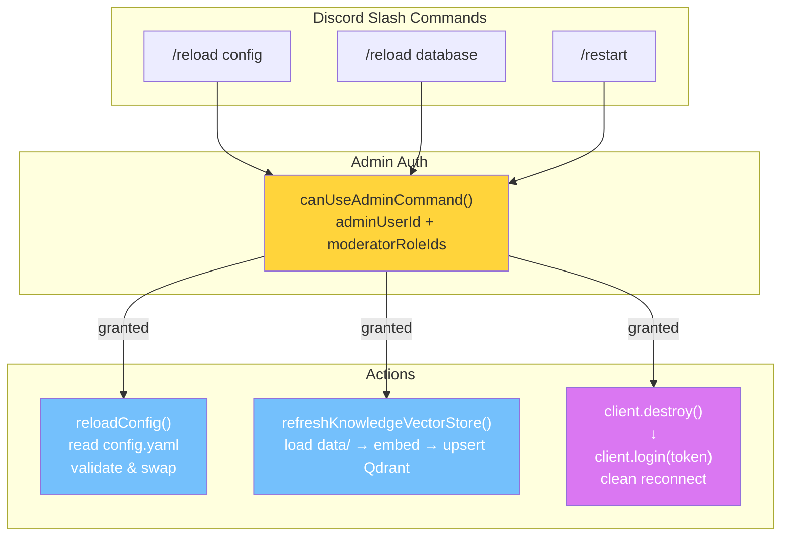
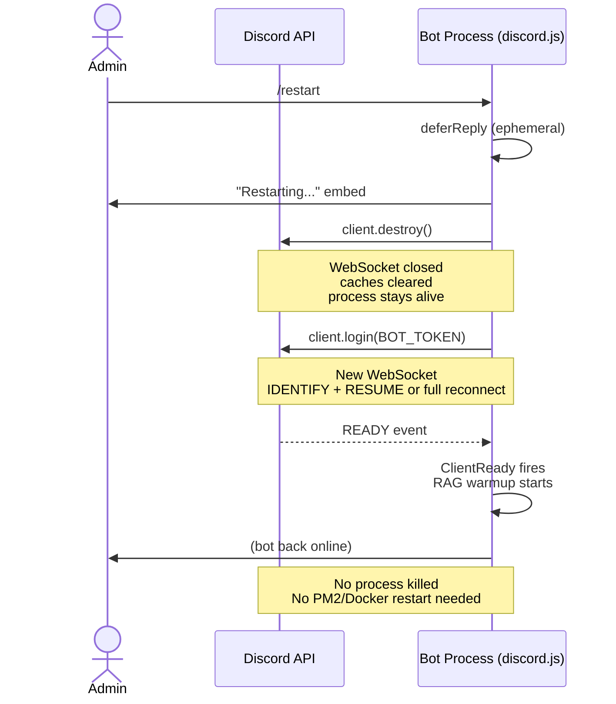

# Command Refactor — Diagram & Flow

## Before / After

## Command Architecture

## /restart — Soft Restart Flow

## File Changes

| File | Action |
|------|--------|
| `src/commands/refresh.js` | ❌ Deleted |
| `src/commands/reload.js` | ✏️ Rewritten — subcommands |
| `src/commands/restart.js` | ✅ New file |
